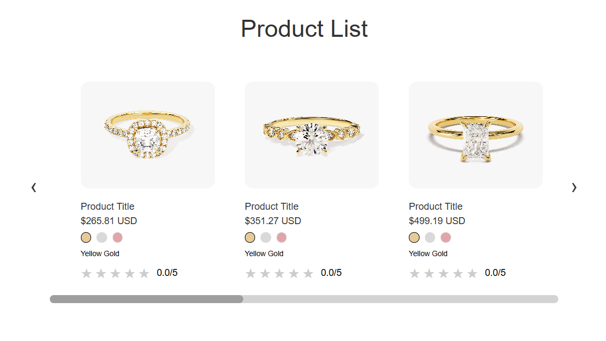

# 🛍️ Ürün Listeleme Uygulaması

**Renart Staj Programı Full-Stack Projesi**

## 🚀 Canlı Demo

- **Frontend (Vercel):** [https://case-study-roan.vercel.app/](https://case-study-roan.vercel.app/)



- **Backend (Railway):** [https://case-study-production.up.railway.app](https://case-study-production.up.railway.app)

### ⚡ Test Endpoints

- **Test API** → [https://case-study-production.up.railway.app/api/test](https://case-study-production.up.railway.app/api/test)
- **Products API** → [https://case-study-production.up.railway.app/api/products](https://case-study-production.up.railway.app/api/products)
- **Gold Price API** → [https://case-study-production.up.railway.app/api/gold-price](https://case-study-production.up.railway.app/api/gold-price)

## 📋 Proje Özeti 

React + TypeScript frontend ve Node.js + Express backend ile geliştirilmiş modern bir ürün listeleme uygulaması. Gerçek zamanlı altın fiyatlarına göre dinamik fiyat hesaplama.

## 🛠️ Teknoloji Stack'i
| Katman | Teknolojiler |
|--------|-------------|
| **Frontend** | React 18, TypeScript, Axios, CSS3 |
| **Backend** | Node.js, Express, Axios, CORS |
| **Deployment** | Vercel (Frontend), Railway (Backend) |

## ✨ Özellikler

### 🎯 Temel Özellikler
- ✅ **Responsive Carousel** - Masaüstü ve mobil uyumlu
- ✅ **Gerçek Zamanlı Fiyat** - Canlı altın fiyatı entegrasyonu
- ✅ **Dinamik Hesaplama** - `(popularityScore + 1) * weight * goldPrice`
- ✅ **Renk Değiştirme** - 3 farklı altın rengi seçeneği
- ✅ **İnteraktif Rating** - Yarım yıldız hassasiyeti
- ✅ **Swipe Desteği** - Mobil touch gestures

## 🔧 Kurulum

### Backend
```bash
cd backend
npm install
npm start
# Uygulama çalıştığında: http://localhost:5000 
```

### Frontend
```bash
cd frontend
npm install
npm start
# Uygulama çalıştığında: http://localhost:3000
```

## 📡 API Endpoint'leri

| Method | Endpoint | Açıklama |
|--------|----------|----------|
| `GET` | `/api/products` | Tüm ürünleri getir |
| `GET` | `/api/gold-price` | Güncel altın fiyatı |
| `GET` | `/api/products/filter` | Filtrelenmiş ürünler |
| `GET` | `/api/test` | Sistem durumu |

### Örnek Kullanım
```javascript
// Tüm ürünleri getir
fetch('/api/products')
  .then(response => response.json())
  .then(data => console.log(data));

// Filtreleme
fetch('/api/products/filter?minPrice=100&maxPrice=500')
  .then(response => response.json())
  .then(data => console.log(data));
  ```

## 🚀 Deployment

### Backend (Railway)
```bash
# Railway kurulumu
npm install -g @railway/cli
railway login
railway link
railway deploy
```

### Frontend (Vercel)
```bash
# Vercel kurulumu
npm install -g vercel
vercel login
vercel --prod
```

### Environment Variables
```bash
# Backend (.env)
PORT=5000
FRONTEND_URL= https://case-study-roan.vercel.app

# Frontend (.env)
REACT_APP_API_URL= https://case-study-production.up.railway.app
```

## 📞 İletişim

- **Geliştirici:** Sema Nur Aktaş 
- **LinkedIn:** [https://www.linkedin.com/in/semanuraktas/](https://www.linkedin.com/in/semanuraktas/) 
- **GitHub:** [https://github.com/semanurakts](https://github.com/semanurakts)

**Proje Linkleri:**  
- 🌐 **Frontend:** [https://case-study-roan.vercel.app/](https://case-study-roan.vercel.app/)
- 🔗 **Backend API:** [https://case-study-production.up.railway.app/api/test](https://case-study-production.up.railway.app/api/test)
- 📂 **GitHub Repository:** [https://github.com/semanurakts/case-study](https://github.com/semanurakts/case-study)

**Not:** Backend Railway free plan üzerinden deploy edilmiştir. İlk yüklemede birkaç saniyelik gecikme yaşanabilir.

**Teknik Sorular İçin:**  
Proje ile ilgili herhangi bir sorunuz veya geri bildiriminiz için yukarıdaki iletişim kanallarından bana ulaşabilirsiniz.
